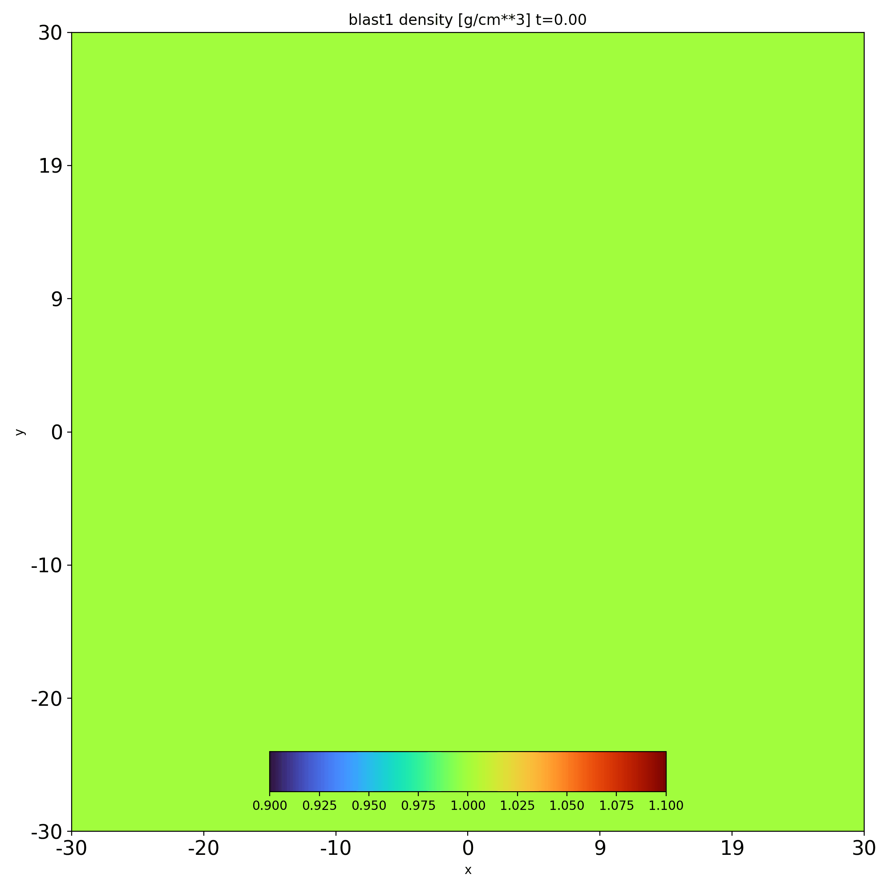

Usage
===========

To use yt moviemaker in a project:

``import yt_moviemaker``

If you also want to use the utility functions, 

``from yt_moviemaker import utils``

A quick working example with some data saved in the local docs/source/blast_test 
::

    from yt_moviemaker import utils, yt_moviemaker

    x = yt_moviemaker.moviemaker()
    data_dir = "./blast_test/"
    filepattern = "Blast.out1."
    sim = "blast1"
    suffix = ".athdf"

    file_list = utils.gen_filelist_from_pattern(data_dir, filepattern, suffix)
    print(file_list)

    x.get_frames_from_file_list(file_list, data_dir, filepattern, sim)
    x.produce(filetype='gif')

Which produces the following file: 

